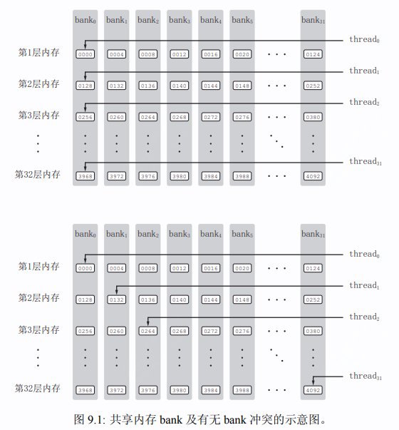

1. 共享内存

   * 同一个线程块中的线程可以直接访问。效率远大于从全局内存中访问。
   * 定义

     ```cpp
     在kernel函数中
     静态
     __share__ T s_y[N];   // T表示变量类型,N表示数组大小。
     动态
     __global__ void kernel()
     {
         extern __share__ T s_y[];
     }
     kernel<<<grid_size, block_size, share_mem_size>>>();  //eg:share_mem_size = sizeof(T)*N
     ```
   * 保证核函数中的语句执行顺序与出现顺序一致，使用 ``__syncthreads()``函数对block中的所有线程进行同步。
2. Bank 冲突

   * 线程块中的线程执行命令通常是以线程束(wrap)为单位进行命令执行，一个wrap中通常为32个线程。同一个wrap中的线程执行相同的命令，但可以使用不同的数据，称为单指令-多线程(SIMT)
   * share memory 在物理上被分成32个bank，bank具有层的概念，每个bank 4个字节。如下图所示，假设申请共享内存大小为128个字节，0-31个数组元素，表示bank第一层，32-63表示第二层，以此类推。
   * 同一wrap中的不同线程访问同一bank的不同地址，会发生bank冲突，bank冲突会明显降低程序运行效率。
   * 解决办法：

     1. 代码直接搞定。
     2. 申请share memory时多申请一部分。eg： `` __share__ T s_y[N][N+1]``

     
