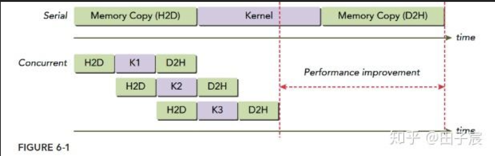

1. CUDA流

   * 原理：cuda程序在运行时，主要时通过CPU进行程序运行，但是当运行到kernel函数时，CPU会直接在发出下一个命令，让GPU去进行核函数的计算，因此，充分利用CPU与GPU与GPU和GPU之间的计算可以节省整个程序的时间开销。（在深度学习计算中，GPU所占用的时间往往远大于CPU，因此通常只考虑GPU计算与数据传输所消耗时间即可。）
   * 使用cuda流可以充分利用host与device 数据传输与kernel函数计算之间的时间(充分利用GPU的计算效率)。

     
2. 不可分页主机内存与异步数据传输

   * 数据传输默认会使用空流，因此要使用异步数据传输。
   * 操作系统在程序运行期间可以改变程序中使用的可分页主机内存的物理地址，因此在执行多流重叠核函数执行与数据传输要申请不可分页主机内存。若使用可分页内存，则后续传输会变为同步传输。
   * 编写cuda流程遵循广度优先，而非深度优先。
3. 常用工具与API

   * nvvp 性能分析工具
   * ```cpp
     cudaStream_t stream_1;
     cudaStreamCreate(&stream_1); // 注意要传流的地址
     cudaStreamDestroy(stream_1);
     cudaError_t cudaStreamSynchronize(cudaStream_t stream);
     cudaError_t cudaStreamQuery(cudaStream_t stream);
     my_kernel<<<N_grid, N_block, N_shared, stream_id>>>(函数参数);
     cudaError_t cudaMemcpyAsync();
     cudaError_t cudaMallocHost();
     cudaError_t cudaHostAlloc();
     cudaError_t cudaFreeHost();
     ```
